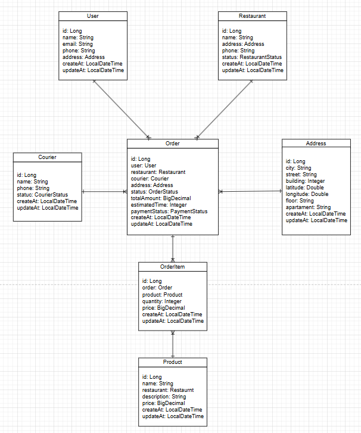

# Лабораторная работа по предмету "Бизнес логика программных систем"

## Задание

Вариант №2812: Деливери — быстрая доставка еды и продуктов — https://market-delivery.yandex.ru. Бизнес-процесс: формирование заказа и оформление доставки.

Описать бизнес-процесс в соответствии с нотацией BPMN 2.0, после чего реализовать его в виде приложения на базе Spring Boot.

Порядок выполнения работы:

Выбрать один из бизнес-процессов, реализуемых сайтом из варианта задания.
Утвердить выбранный бизнес-процесс у преподавателя.
Специфицировать модель реализуемого бизнес-процесса в соответствии с требованиями BPMN 2.0.
Разработать приложение на базе Spring Boot, реализующее описанный на предыдущем шаге бизнес-процесс. Приложение должно использовать СУБД PostgreSQL для хранения данных, для всех публичных интерфейсов должны быть разработаны REST API.
Разработать набор curl-скриптов, либо набор запросов для REST клиента Insomnia для тестирования публичных интерфейсов разработанного программного модуля. Запросы Insomnia оформить в виде файла экспорта.
Развернуть разработанное приложение на сервере helios.

## BPMN 2.0 диаграмма

## UML-диаграммы классов


## Спецификация REST API
### Управление заказами со стороны курьера.
### Courier Controller ```/api/courier```

**Получить активные заказы курьера** \
**GET** ``/api/courier/active`` \
**Заголовки:** ``X-Courier-Id``

**Отметить, что курьер забрал заказ** \
**PUT** ```/api/courier/pickup``` \
**Заголовки:** ``X-Courier-Id``

**Отметить, что заказ доставлен** \
**PUT** ```/api/courier/deliver``` \
**Заголовки:** ``X-Courier-Id``

### Оформление и проверка заказа покупателем.
### Order Controller ```/api/order```

**Проверить заказ (расчёт стоимости и времени)** \
**POST** ```/api/order/check``` \
**Тело запроса:** 
```bash
{
  "userId": 123,
  "restaurantId": 123,
  "items": [
    {"productId": 1, "quantity": 2},
    {"productId": 3, "quantity": 1}
  ]
}
```

**Подтвердить заказ (создать заказ)** \
**POST** ```/api/order/confirm``` \
**Тело запроса:** 
```bash
{
  "userId": 123,
  "restaurantId": 123,
  "items": [
    {"productId": 1, "quantity": 2},
    {"productId": 3, "quantity": 1}
  ]
}
```

**Получить информацию о заказе по ID** \
**GET ** ```/api/order/info``` \
**Заголовки:** ``X-Order-Id``

### Управление заказами со стороны ресторана.
### Restaurant Controller ```/api/restaurant```

**Получить новые заказы** \
**GET** ```/api/restaurant/active``` \
**Заголовки:** ``X-Restaurant-Id``

**Подтвердить заказ** \
**PUT** ```/api/restaurant/confirm``` \
**Заголовки:** ``X-Restaurant-Id``

**Отклонить заказ** \
**PUT** ```/api/restaurant/decline``` \
**Заголовки:** ``X-Restaurant-Id``

**Отметить заказ как готовый** \
**PUT** ```/api/restaurant/ready``` \
**Заголовки:** ``X-Restaurant-Id``

## Запуск и управление проектом

### Запуск приложения
```bash
mvn spring-boot:run
```
### Форматирование кода
```bash
mvn spotless:apply
```
